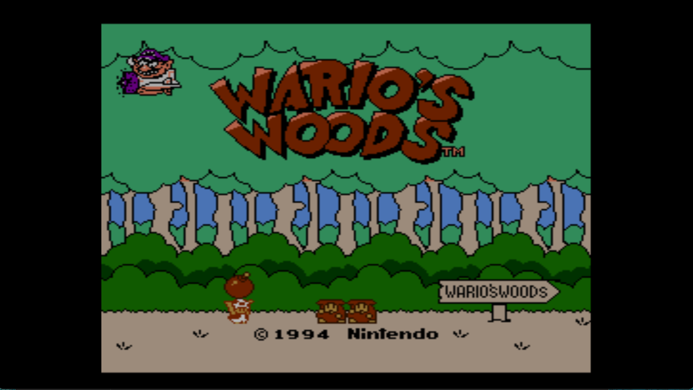
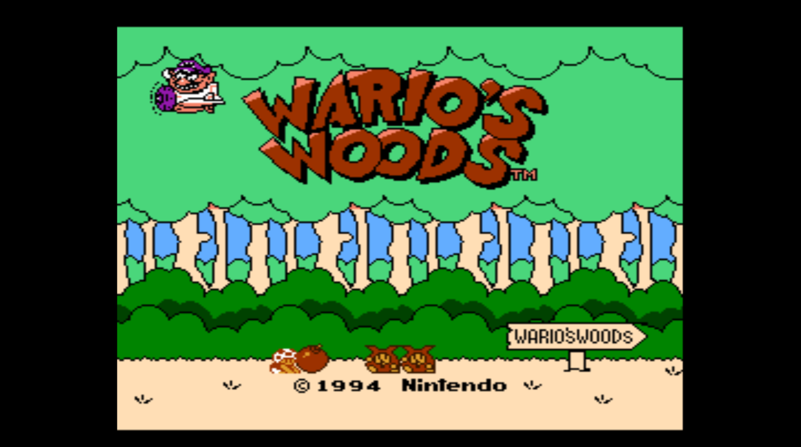

Improves the default color palette for NES RPX using FirebrandX's Composite Direct palette instead.

RPX must be decompressed.

Usage: RPXColor <input.rpx> <output.rpx>

Before:

After:

To compile, you'll need the [.NET SDK](https://dotnet.microsoft.com/en-us/download) installed.

Run the following command in the root of the project:

bash:
dotnet publish -c Release -r win-x64 --self-contained true -p:PublishSingleFile=true -p:PublishTrimmed=true

Special Thanks:
FirebrandX,
SunkenSkunk (gbatemp),
Cemu team